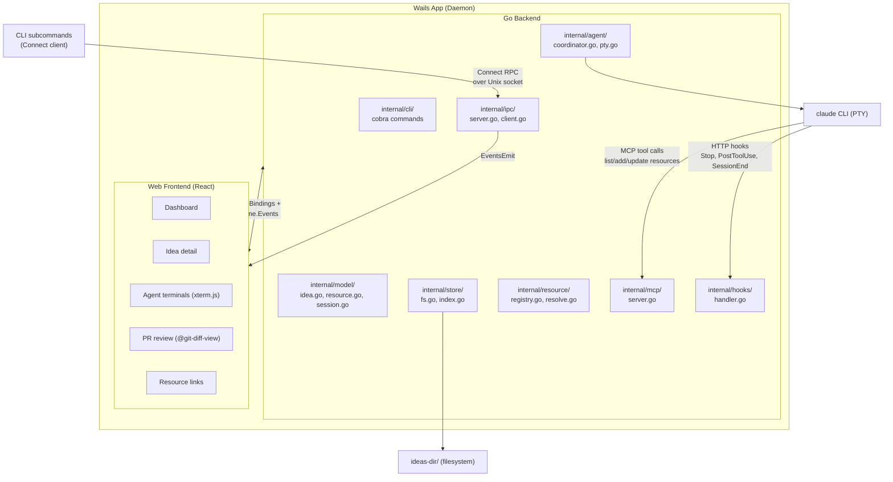

# CLAUDE.md — Ideate

## What This Is

Ideate is a desktop app (Wails: Go backend + web frontend) for tracking ideas through their lifecycle. v0.1 ships macOS-only; cross-platform (Linux/Windows, Intel) is on the roadmap. Phases are non-linear — an idea can start/end in any phase, skip phases, or only use one. See [README.md](README.md) for the user-facing overview.

## Tech Stack

- **Go** backend via [Wails](https://wails.io/) v2
- **React** frontend in system webview (`HashRouter`)
- **CLI**: Cobra subcommands — root launches Wails app (daemon), subcommands are IPC clients
- **IPC**: Daemon/client via [Connect](https://connectrpc.com/) (gRPC-compatible) over Unix domain socket. Proto-defined RPCs, buf for codegen.
- **Local filesystem storage**: each idea is a subdirectory under a user-configurable ideas directory
- **Agent integration**: `claude` CLI via `creack/pty` (interactive PTY sessions) + Ideate MCP server + HTTP hooks
- **Terminal rendering**: xterm.js in frontend, `creack/pty` in Go
- **PR review**: `@git-diff-view` for diff rendering with inline comments, `gh` CLI for GitHub integration

## Project Structure

```
cmd/ideate/                 # Entry point (main.go + wails.json)
proto/ideate/ipc/v1/        # Proto service definition (ipc.proto)
internal/
  gen/                      # Generated proto + Connect code (gitignored)
  cli/                      # Cobra command definitions (root, review, status)
  app/                      # Wails App struct, lifecycle, launch config
  ipc/                      # Connect server + client over Unix socket
  model/                    # Core types: Idea, Resource, Session, HistoryEvent
  store/                    # Filesystem store: read/write ideas, index management
  service/                  # Business-logic funnel; wraps store + coordinator for non-UI callers
  agent/                    # Agent coordination: PTY, session lifecycle, context injection
  resource/                 # Resource type registry, URL resolution, validation
  mcp/                      # Ideate MCP server: resource management tools for Claude sessions
  hooks/                    # HTTP handler for Claude Code hook events
frontend/                   # Web frontend (React, HashRouter)
```

## Build and Run

```sh
task dev       # Start Wails dev server
task build     # Build production binary
task test      # Run tests
task lint      # Run linters
```

## Architecture



### Three localhost servers

| Service | Audience | Transport |
|---------|----------|-----------|
| IPC server | CLI subcommands | Connect over Unix socket |
| MCP server | Claude agent sessions | localhost TCP (SSE) |
| Hooks handler | Claude hook events | localhost TCP |

All started/stopped by the `App` struct. MCP and hooks use TCP because the Claude subprocess needs reachable URLs in config files. IPC uses Unix socket because its only clients are local CLI invocations of the same binary.

### Service layer

`internal/service.IdeaService` is the business-logic funnel for non-UI callers. It wraps `*store.FSStore` + `*agent.AgentCoordinator` and exposes the union of methods that `mcp.IdeaStore` (`internal/mcp/server.go`) and `hooks.SessionStore` (`internal/hooks/handler.go`) declare. Consumers depend on their own narrow interfaces (Go's "accept interfaces, return structs") and the concrete `*IdeaService` satisfies them all. App constructs the service once in `New()` and passes it to MCP and hooks construction. App-bound Wails methods continue to call `a.store.*` directly today; methods that need cross-cutting logic (lifecycle ops like Archive that must stop sessions before unlinking repos) migrate to the service as those features land.

### Agent coordination flow

Central `AgentCoordinator` (singleton) manages all session lifecycles:

1. User selects idea, picks a target repo (or idea root), clicks "Start Agent Session"
2. `AgentCoordinator` creates a session record under `<idea>/sessions/` and writes a manifest to `~/.ideate/sessions/`
3. `AgentRunner` (per agent type) generates context files and spawns the process (Claude: CLAUDE.md, settings JSON for HTTP hooks, MCP config)
4. PTY subprocess allocated via `creack/pty`; output streamed to frontend via Wails events
5. User can interact with the agent terminal directly
6. During session: HTTP hooks POST events to Ideate's local endpoint for status tracking
7. During session: Claude calls Ideate MCP tools to manage resources (`add_resource`, `update_idea`, etc.)
8. On session end: `SessionEnd` hook fires; Go reads transcript, updates session record, removes manifest, appends to `history.jsonl`
9. On app restart: `AgentCoordinator.Adopt()` scans manifests, health-checks PIDs, reconnects live sessions

### Session architecture (informed by Superset patterns)

- **Process isolation**: Each agent session runs in its own PTY subprocess, isolated from other sessions. One agent's crash or hang doesn't affect others.
- **Manifest-based persistence**: Sessions write a manifest file on start and remove it on clean exit. Enables crash recovery (scan manifests on app restart, health-check PIDs, re-adopt live sessions) and daemon mode (sessions survive UI close/reopen cycles).
- **Split control/stream communication**: Separate channels for PTY output (high-frequency) and commands (kill, resize, signal). Prevents high-frequency I/O from blocking control operations.
- **Shell readiness detection**: Wait for prompt marker before injecting context, rather than a fixed delay. Prevents races with shell initialization.

## Data Model

### Directory structure

Ideas live in a user-configured directory (not inside this repo):

```
<ideas-dir>/                          # User-configured, independently backupable
  config.json                         # App config, resource type registry
  <idea-slug>/
    idea.md                           # YAML frontmatter + Markdown body
    context.md                        # Primary context (synthesized or authored)
    *.md                              # Additional context / reports as needed
    repos/                            # Worktrees of canonical repos
      <repo-name>/                    # git worktree on per-idea branch
    sessions/
      <session-uuid>.json             # Agent session metadata
    history.jsonl                     # Append-only state change log
    backlog.json                      # Per-idea task list (BacklogItem[])
```

Key design points:
- The ideas directory is user data — backup, sync, or version-control it independently.
- Each idea may reference multiple code repositories under `repos/` (worktrees of canonical clones).
- When spawning an agent, it runs inside a specific repo directory or at the idea root level.
- `idea.md` carries YAML frontmatter for structured metadata (name, status, resources, ...) plus the body for human notes. Git-diffable, editable in any text editor.

### Idea (`<slug>/idea.md`)

```markdown
---
name: Add batch processing to import pipeline
created: 2026-04-10T14:30:00Z
status: active
updated: 2026-04-16T09:15:00Z
resources:
    - type: notion
      url: https://www.notion.so/acme/Batch-Processing-Design-abc123
      label: Design doc
    - type: github_pr
      url: https://github.com/acme/pipeline/pull/89
      label: Service PR
      status: approved
    - type: feature_flag
      url: https://flags.example.com/projects/pipeline/flags/batch-processing-v2
      label: Rollout flag
      status: 50%
---

# Add batch processing to import pipeline

Free-form Markdown body. Used by the dashboard summary line and the
detail view. The summarizer regenerates a one-line intent from this body
+ session activity into a sidecar file.
```

### Status vs phase

Orthogonal dimensions:
- **Status**: Work state — `active`, `paused`, `archived`.
- **Phase**: What kind of work is happening right now. A label, not a position in a pipeline.

**Status lifecycle is an explicit state machine.** Transitions go through dedicated MCP tools — `archive_idea`, `unarchive_idea`, `pause_idea`, `resume_idea` — not the `update_idea*` tools (which reject a `status` field). Each transition carries its side effects:

- `archive_idea(slug, force)`: refuses on running sessions (unless `force=true`, then stops them); refuses on dirty worktrees (unless `force=true`); persists each linked repo's origin URL as a `repo` resource; unlinks worktrees; flips status to `archived`.
- `unarchive_idea(slug)`: flips status to `active`; returns `RepoResources` listing the `repo` entries — caller re-links manually with `link_repo_by_slug` (no auto-clone in v1).
- `pause_idea(slug, until?)`: status → `paused`, sets `PauseUntil` (optional).
- `resume_idea(slug)`: status → `active`, clears `PauseUntil`.

New ideas are created with `status=paused`; first session start auto-flips to `active`. Unknown status values **read-repair to `active`** on parse (`internal/model/frontmatter.go`); no migration framework needed.

State gating: archived ideas refuse `link_repo*` and session start (new + resume) with `service.ErrIdeaArchived`. Cleanup ops — `unlink_repo*`, `add_resource*`, `delete_resource*`, `update_idea*` — work in any state. Archive means "no new work," not "frozen."

**Phases are non-linear, optional, and unordered.** An idea can start/end in any phase, skip phases entirely, or only use one or two. Available phases: `research` · `design` · `triage` · `investigation` · `implementation` · `review` · `deploy` · `rollout` · `monitoring` · `cleanup` · `postmortem`.

### Go core types

Source of truth: `internal/model/idea.go`, `internal/model/session.go`. Keep these in sync with the doc; the doc is illustrative, the code is canonical.

```go
type Idea struct {
    Name       string     // unique per ideas-dir, free-form
    Slug       string     // derived directory name; not persisted in frontmatter
    Created    time.Time
    Status     Status     // active | paused | archived
    PauseUntil *time.Time // when Status=paused
    Updated    time.Time
    Resources  []Resource
    Summary    string     // sidecar-loaded, not in frontmatter
}

type Resource struct {
    Type   string // github_pr | notion | feature_flag | repo | web | ...
    URL    string
    Label  string
    Status string // free-form; rendering hint (e.g. "approved", "50%")
}

type AgentSession struct {
    UUID         string            // stable session id, passed to agent CLI
    Agent        string            // "claude-code", "testagent"
    Status       SessionStatus     // running | completed | stopped | failed | dormant
    Activity     SessionActivity   // active | idle | waiting | reviewing (running only)
    StopReason   SessionStopReason // user | shutdown | exit | crash | cleared | compacted | orphaned
    PreviousUUID string            // predecessor across /clear or /compact
    Started      time.Time
    Ended        *time.Time
    Outcome      string
    WorkingDir   string
    RepoName     string            // when spawned inside a linked repo
    ActiveReviewID string           // set while a review tool result is pending
}

type HistoryEvent struct {
    Timestamp time.Time
    Event     string
    Session   string
    Fields    map[string]any
}
```

Type, Phase, Parent, DependsOn, Related, Tags on Idea are intentionally absent — earlier drafts of this doc described a richer schema that was simplified during implementation. Backlog items carry `depends_on` and `affects` instead; see `internal/model/backlog.go`.

### Resource types

Ideas link to external systems via typed resources defined in a registry:

- Each resource type has a URL pattern for resolution and optional field validation.
- Resources are stored in `idea.md` frontmatter.
- Many are actively monitored (PR status, CI, deploy progress, flag %, metric alerts).
- Polling uses exponential backoff, max ~5 minutes between polls.
- Integration priority for new types: MCP server first → CLI tool second → direct API third.

Monitored resource types include `github_pr` (status + CI + merge ordering), `feature_flag` (rollout %, kill switch), deploy systems (deploy request status), and observability (alert state for linked monitors).

#### Agents auto-add resources

Agents proactively populate the resource list — no user prompt required. Three discovery channels feed `IdeaService.AddResource` (canonical-URL dedupe + type promotion):

1. **Live session prompt.** The per-idea Claude system prompt carries a `<resources>` block listing trigger conditions (create/comment a GitHub PR; reference a Jira ticket; create/read a Notion doc; WebFetch a vendor doc; link a repo; touch a feature flag, deploy job, monitor). Agents invoke `add_resource` directly. `add_resource`'s description repeats the trigger list and notes the idempotent in-place-update semantics.
2. **Headless summarizer suggestions.** The `SessionEnd` regenerate pipeline parses a `suggested_resources` array from the summarizer's JSON reply and applies each via `Store.AddResource`. Catches links the live agent forgot.
3. **WebFetch PostToolUse hook.** `internal/hooks/handler.go` HandleToolUse routes WebFetch events through `maybeTrackWebFetch`, which extracts the fetched URL and (best-effort) the page title, then calls `Store.AddResource` with `type="web"`. Non-WebFetch tools are no-ops — the auto-tracking surface is intentionally narrow.

All three channels are best-effort: failures log warn and don't propagate. Dedupe is by canonical URL (`model.NormalizeResourceKey`: lowercases host, strips fragment + trailing slash + `.git`, normalizes `git@host:path` → `https://host/path`). Type promotion: a `web` resource is upgraded to a richer type (`github_pr`, `repo`, `notion`, etc.) on a subsequent add.

`LinkRepo` also auto-adds a `repo` resource for the source repo's origin URL.

There is no separate `update_resource` tool — `add_resource` is the single upsert path. Resources can be pruned via `delete_resource(url)` (session-scoped, current idea) or `delete_resource_by_slug(slug, url)` (orchestrator). Match is by canonical URL; deleting an unknown URL is an idempotent no-op.

### Backlog

Each idea owns a task list at `<slug>/backlog.json` — a JSON array of `model.BacklogItem` (`{id, title, body?, status, created, updated, source?, assignee_session?, external_url?, depends_on?, affects?}`). Same full-rewrite pattern as `idea.md` resources; expected to stay O(100) items per idea. `status` ∈ {`open`, `in_progress`, `done`, `wontfix`} with read-repair on parse (unknown values → `open`).

`depends_on` is the sequencing signal — bare `id` for same-idea, `slug:id` for cross-idea. `affects` lists file paths (relative to idea root) the item is expected to touch; the orchestrator uses non-overlapping `affects` sets to fan work out to parallel subagents without write conflicts. Both stored without validation in v1 (no cycle detection, no existence checks).

`external_url` points at the upstream issue / ticket / task the item mirrors when synced to an external tracker (GitHub Issues, Jira, Todoist). Same pattern as `Resource.URL` — the URL is both the navigation target and the canonical identity for sync. Empty for local-only items (the v1 default; sync pipeline isn't built yet).

MCP surface mirrors `resources`:

- Current-idea (per-session server): `list_backlog`, `add_backlog_items`, `update_backlog_items`, `delete_backlog_items`.
- By-slug (per-session + orchestrator via `addCrossIdeaTools`): `list_backlog_by_slug`, `add_backlog_items_by_slug`, `update_backlog_items_by_slug`, `delete_backlog_items_by_slug`.

Bulk-by-default per the MCP-batching rule in `## Conventions`: all mutating tools take arrays (`items`, `patches`, `ids`); single-element invocations are the trivial case.

System-prompt discipline: the per-idea system prompt's `<backlog>` block tells the agent when to add (mid-flow follow-ups, sibling-idea handoffs), when to update (status transitions), and when to surface to the user (session start, before exit, when stuck). The orchestrator prompt's parallel guidance routes user-mentioned work onto the relevant idea's backlog via `add_backlog_items_by_slug` instead of letting it slip into conversation.

## Agent Integration

### Two modes

1. **Interactive sessions** (PTY + xterm.js) — user-visible, long-running. The user sees the real Claude Code TUI and interacts directly. Used for research, implementation, investigation, review.
2. **Non-interactive calls** (`--print`) — background, short-lived, structured JSON output. Used for meta workflows that don't need a terminal UI: session summary generation (post-`SessionEnd`, from transcript), context synthesis, resource discovery, phase suggestions.

### Interactive sessions

- Spawn agent CLI as PTY subprocess via `AgentRunner` (inherits user's auth and MCP servers).
- Process-isolated: each session = own PTY subprocess, one crash doesn't affect others.
- **Ideate MCP server** injected per-session via `--mcp-config`: `get_idea`, `list_resources`, `add_resource`, `delete_resource`, `update_idea`, plus the bulk backlog tools and cross-idea (`*_by_slug`) variants.
- **HTTP hooks** configured per-session via `--settings`: `Stop`, `PostToolUse`, `SessionEnd` events POST to Ideate's local HTTP endpoint.
- Context injection: agent-type-aware (CLAUDE.md for Claude, equivalent for others).
- **Session identity**: stable agent session ID passed as `--session-id` (new) or `--resume` (existing). UUID for Claude.
- **Session resume**: `AgentResumer` optional interface. 1 active session per working directory.
- **Dev builds** (`-tags dev`): include testagent runner. Release builds: only production runners.
- **testagent**: provided by upstream [`github.com/paultyng/testagent`](https://github.com/paultyng/testagent), wired in via Go 1.24's `tool` directive in `go.mod`. `task build:testagent` resolves the binary through the module cache — no in-tree source. The `TestAgentRunner` invokes upstream's `claude` subcommand and synthesizes Claude-shaped settings + mcp-config files per session so the same hook/MCP plumbing exercises both runners.

### Multi-agent future

Architecture avoids Claude lock-in:

- Agent spawning is behind an `AgentRunner` interface — not hardcoded to `claude` binary.
- Session records store `agent: "claude-code"` as a type field.
- Context injection uses generic mechanisms (system prompt, env vars, temp files), not Claude-specific features.
- The PTY/xterm.js approach works for any CLI-based agent.

## Capture Mode (debug / fixtures)

Set `IDEATE_CAPTURE_DIR=/some/path` before launching ideate to record every hook POST and every MCP JSON-RPC frame to disk. Layout:

```
<dir>/
  <session-id>/
    hooks/
      0001-stop.json        # {timestamp, method, path, headers, body}
      0002-tool-use.json
    mcp/
      meta.json             # last HTTP exchange's headers + remote_addr
      0001-in-initialize.json
      0002-out-result-1.json
      0003-out-notifications_progress.json
```

`<session-id>` is the `X-Ideate-Session-Id` header (or `unknown-session`). Each frame file has `{timestamp, direction, frame}`. Both plain `application/json` MCP responses and `text/event-stream` SSE responses are captured frame-by-frame. `Authorization` headers are stripped; everything else is preserved.

To populate testagent fixtures: set `IDEATE_CAPTURE_DIR=...` before launching, run a real Claude session, copy the resulting tree to testagent's `testdata/captures/`.

## Review

Reviews are **not idea-locked** — both kinds work in two modes:

- **In-session (MCP)**: agent inside an Ideate session calls `request_diff_review` / `request_markdown_review`; idea slug derived from session.
- **Standalone CLI loop**: any `claude` invocation in any project uses `ideate review diff start` / `ideate review md start`; no idea required.

Review records all live in a single central directory at `<configDir>/reviews/<id>.json`, regardless of kind or origin.

**Diff review**:

- Local diffs only — generated from repos under `<idea>/repos/` via `git diff`, not fetched from GitHub API.
- `@git-diff-view` for diff rendering UI (virtual scrolling, syntax highlighting, widget system).
- Review layer built in-house: inline commenting, threading.
- Comments push to GitHub via `gh` CLI; remote comments pulled in for display.
- MCP tools: `request_diff_review`, `get_diff_review_result`.

**Markdown review**:

- [Milkdown](https://milkdown.dev/) WYSIWYG editor + [CriticMarkup](https://criticmarkup.com/) inline feedback (`{++ins++}`, `{--del--}`, `{~~old~>new~~}`, `{>>comment<<}`).
- No separate diff view — the inline overlay IS the diff.
- MCP tools: `request_markdown_review`, `get_markdown_review_result`.

## CLI

```sh
ideate                                 # Launch app (daemon mode — starts IPC server)
ideate review <id>                     # Open existing review by ID (kind-detected)
ideate review status <id>              # Print review record as JSON
ideate review diff [--repo --base --head]              # Open diff review UI
ideate review diff start [--repo --base --head]        # Create diff review, print ID
ideate status                          # Check if app is running
```

Session creation, repo linking, and idea import are UI-only (the
"Start Session" / "Link Repo" / "Create Idea" buttons) plus their
MCP equivalents (`start_idea_session`, `link_repo*`, `create_idea`)
for agents. The CLI deliberately doesn't duplicate them.

## Integrations

Ideate doesn't bundle vendor-specific clients. Two access patterns:

- **Agent-mediated (MCP)** — agent sessions inherit the user's `~/.claude/settings.json` MCP servers, so any tool with an MCP server is reachable from a session without Ideate-specific glue.
- **Direct polling (API/CLI)** — for active monitoring (PR status, CI, deploy progress, flag rollout, metric alerts), the resource type registry declares each type's polling shape; the Go backend dispatches with exponential backoff.

Integration priority for new resource types: MCP first → CLI second → direct API third.

## Resolved Decisions

- **Frontend**: React (larger component ecosystem for `@git-diff-view`, xterm.js).
- **Wails v2**: v3 has been in alpha for 3+ years. Ship on v2, migrate later if v3 stabilizes.
- **Personal only**: No multi-user sharing. Collaboration happens through existing tools (GitHub PRs, etc.).
- **Storage**: Local filesystem (JSON + Markdown). Independently backupable, git-diffable, editable in any text editor.
- **Agent sessions are interactive**: User sees the real Claude Code TUI via PTY + xterm.js. No headless/SDK mode for interactive sessions — `claude-agent-sdk-go` is incompatible with PTY.
- **Claude Code first, multi-agent future** via `AgentRunner` interface. Terminal-based orchestration means any CLI agent works without adapter code.
- **Session persistence**: Manifest files in `~/.ideate/sessions/` enable crash recovery and daemon mode. Human-scannable filenames.
- **Process isolation**: Each agent session = separate PTY subprocess. Split control/stream communication.
- **Ideate MCP server**: Single long-lived HTTP/SSE server on localhost, shared by all sessions. Session/idea identity passed via URL path or params in per-session `--mcp-config`.
- **HTTP hooks for session lifecycle**: more reliable than relying on Claude to call MCP tools for status/summary.
- **Local diffs for PR review**: always generated locally from repos under `<idea>/repos/`. Works offline, fast, consistent with local-first philosophy. Comments push to GitHub via `gh` CLI.
- **Markdown review**: Milkdown chosen over MDXEditor for smaller bundle, fewer deps, more composable plugin model. CriticMarkup for inline feedback (insertions, deletions, substitutions, comments — highlight intentionally not surfaced since it carries no actionable signal).
- **Review persistence**: Pending reviews survive app close/restart in lockstep with their linked session. Startup sweep cancels only orphaned reviews (StopReason=user|exit|cleared|compacted|orphaned, or session record gone) or those past a 30-day staleness cap. In-progress edits autosave to `draft_body` / `draft_comments` / `markdown.draft_marked_up` so the human's work survives a crash; the editor hydrates from those fields on reopen, and submit / cancel / reopen clear them.
- **CLI architecture**: Cobra subcommands. Single binary — root command launches Wails app (daemon), subcommands are thin IPC clients.
- **IPC**: [Connect](https://connectrpc.com/) (gRPC-compatible) over Unix domain socket. Domain-specific RPCs (`OpenReview`, `GetStatus`).
- **Service layer**: `internal/service.IdeaService` is the business-logic funnel for non-UI callers (MCP, hooks, CLI, future cron). Concrete struct; consumers declare their own narrow interfaces ("accept interfaces, return structs"). Wraps Store + Coordinator. App keeps its Wails-bound business methods but holds the service alongside; service-owned operations (lifecycle ops, auto-tracking) route through it.
- **Status transitions are explicit tools**, not field updates: `archive_idea`, `unarchive_idea`, `pause_idea`, `resume_idea`. `update_idea*` rejects a `status` field with a pointer to the four lifecycle tools. Each transition owns its side effects.
- **Three-state lifecycle**: `active | paused | archived`. New ideas start `paused`; first session auto-flips to `active`. Unknown status values on parse read-repair to `active` (debug log; no migration). Archive releases each linked repo's origin URL as a `repo` resource then unlinks; the unarchive report lists those URLs so the caller can re-link via `link_repo_by_slug`.
- **Resources auto-populate**: agents proactively call `add_resource` from the live session (driven by the system prompt's `<resources>` block); the headless summarizer can return `suggested_resources` in its JSON; the WebFetch PostToolUse hook tracks fetched URLs as `type="web"`. All three channels share `model.UpsertResource` (canonical-URL dedupe, type promotion). No separate `update_resource` tool — `add_resource` is the single upsert path.

## Configuration

User-level knobs live in `<ideas-dir>/config.json`. Per-agent runner settings nest under `agents.<name>` so future Cursor / Codex blocks don't have to share Claude's flag surface.

```json
{
  "agents": {
    "claude": {
      "add_dirs":   ["~/.claude/skills"],
      "extra_args": ["--debug"]
    }
  }
}
```

- `agents.claude.add_dirs` — extra `--add-dir` paths appended for every Claude session. `~` and `$VARS` are expanded at session start.
- `agents.claude.extra_args` — verbatim CLI flags appended **after** every Ideate-managed flag (so the user's `--model` / `--debug` wins by last-occurrence). Overriding Ideate's own flags (`--settings`, `--mcp-config`, `--resume`, `--session-id`) will break hooks, MCP, and resume.

Per-idea `--add-dir` paths are computed automatically and include the idea root **plus every linked repo's absolute path** — so per-repo `.claude/skills/` directories are picked up without listing them in `config.json`. User-configured paths union on top, deduped, with the per-idea entries first.

Config is re-read on every Claude session start or resume. Edits to `config.json` land on the next session without an app restart; no fsnotify watcher.

## Conventions

- Use [go-task](https://taskfile.dev/) (`Taskfile.yaml`) for automation, not Makefiles.
- [Conventional Commits](https://www.conventionalcommits.org/) for all commit messages.
- No generated file edits — fix the generator input, not the output.
- Minimal changes — only what's requested, no drive-by cleanup.
- **MCP tools are bulk by default.** Any MCP tool whose typical caller fans out >1 invocation — regardless of source (a prior `list_*` read, a structured doc, a graph of related items, a multi-target setup flow) — takes a bulk-input shape *before it ships*. Singular tools are dropped in favor of bulk variants invoked with N=1 for the trivial case. The rule applies equally to reads (`list_*` returning the data N follow-up `get_*` calls would have fetched, or an `include_*` toggle for expensive per-element data) and writes (`add_items([])`, `update_items([])`, `delete_items([])` instead of `add_item` / `update_item` / `delete_item`). N+1 round-trip patterns burn orchestrator turns, encourage skills to silently degrade into per-item loops, and surface friction the moment a real bulk use case lands (seeding from a doc, importing from another tool, applying a sweep). Audit on add. Re-audit existing tools when the call graph shows a new fan-out.

## Testing

- Every interactable UI element must have Playwright test coverage (`frontend/playwright/`).
- When adding a new view, button, form, or navigation flow, add a corresponding Playwright test.
- Tests should verify actual rendered content (not just element visibility) — check text, data, sidebar items.
- Go backend: unit tests for model/store logic, integration tests with real filesystem (`t.TempDir()`).
- `task test:ui` runs all Playwright tests against `wails dev` (builds testagent, starts server, runs tests, cleans up).
- `go test ./...` runs all Go tests.
- **Manual test plan**: [TESTPLAN.md](TESTPLAN.md) tracks scenarios that require human verification.
