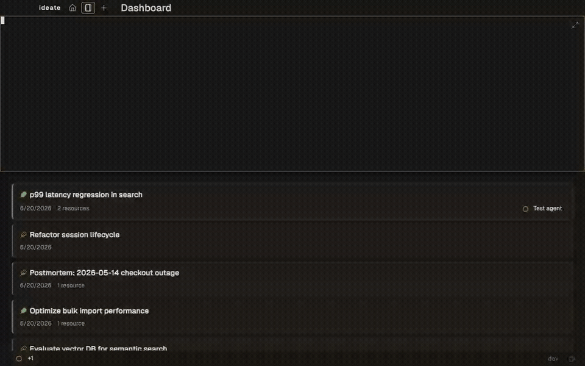
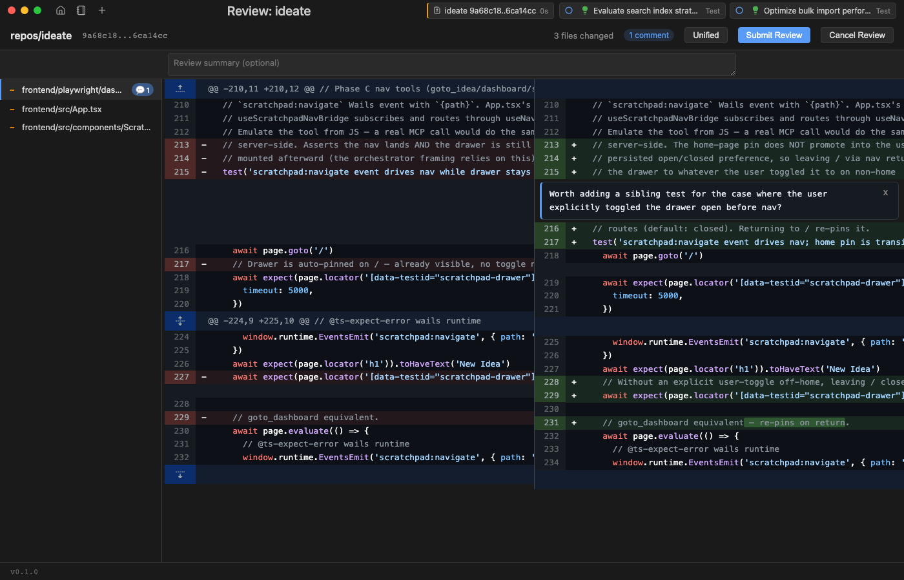
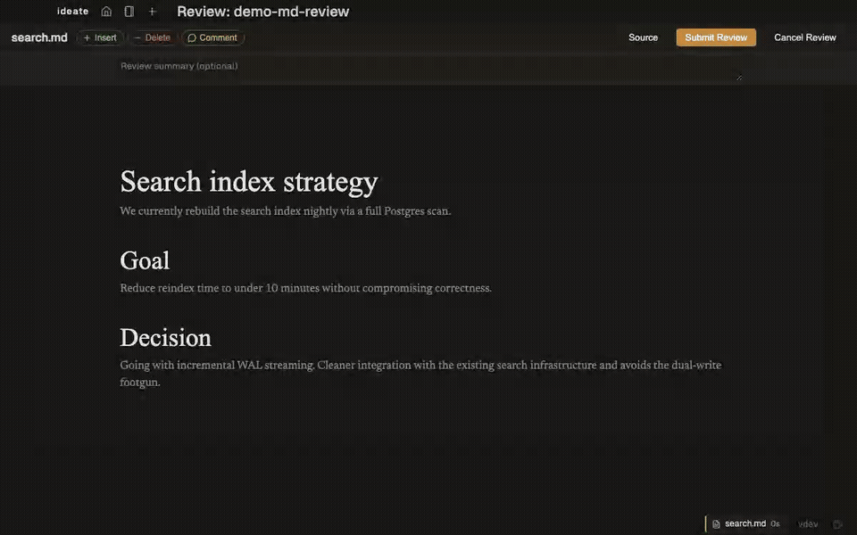

# Ideate

[](LICENSE)
[]()

> One home for every idea.

Each idea is a directory — linked repos as worktrees, context files, external resources, and AI agent sessions, all in one place. A session can range across multiple repos on the same branch. Agents request diff and markdown reviews via MCP; you respond inline.


## Why Ideate

- **One repo, multiple repos, or none** — the idea is the unit; link code only when the work calls for it.
- **Per-idea worktrees** — when code is in play, sessions range across linked repos on a shared branch, no stash juggling.
- **In-app review loop** — agents request diff or markdown reviews via MCP; you respond inline in the same surface.

If this resonates, [star the repo](https://github.com/paultyng/ideate).

## Status

**v0.1 preview release. macOS only.** Pre-built downloads from the Releases page are signed + notarized — first launch opens normally. If you build from source the binary is adhoc-signed, so first launch needs right-click → Open. M-series Mac tested; Intel/Linux/Windows on the roadmap.

Not for you if: you need multi-user sharing, cloud sync, or Linux/Windows today.

## Install

### Pre-built (macOS)

Grab the latest signed `.dmg` from [Releases](https://github.com/paultyng/ideate/releases/latest); open it, drag Ideate to Applications. Tag-driven CI signs and notarizes on every `v*` tag. If no release is listed yet, build from source below.

### From source

Prereqs: Go 1.26+, Node 20+, [go-task](https://taskfile.dev/), [buf](https://buf.build/docs/installation).

```sh
git clone https://github.com/paultyng/ideate.git
cd ideate

task setup            # install wails CLI + npm install in frontend/
task generate:proto   # generate proto code into internal/gen/
task build            # produces cmd/ideate/build/bin/ideate.app

open cmd/ideate/build/bin/ideate.app
```

## Daily Use

1. Launch `ideate` (or open the .app). The dashboard shows your ideas grouped by status.
2. The orchestrator drawer is pinned on the home page. Type into it ("create an idea called X", "list my active sessions") and the agent dispatches the right MCP tool.
3. Click any idea to open its detail view: sessions, repo worktrees, context files, history. Start an agent session from the sidebar.
4. Reviews — diff or markdown — go through the same surface. Agents request them via MCP; you respond inline; the agent sees your feedback in the next turn.

The footer toggles a sleep inhibitor for long-running sessions.

## Screenshots

### Quick-switch across ideas



### Diff review with inline comment



### Markdown review with CriticMarkup edits



## CLI

Single binary; subcommands talk to a running app via Unix socket.

| Command | Purpose |
|---|---|
| `ideate` | Launch the app (daemon) |
| `ideate review <id>` | Open a review by ID (diff or markdown — kind detected) |
| `ideate review diff` | Open diff review UI for an existing review |
| `ideate review diff start` | Create a new diff review and print its ID |
| `ideate review md start --path <file>` | Create a new markdown review for the given file |
| `ideate review status <id>` | Print review record as JSON |
| `ideate status` | Health check (is the app running?) |

Session creation, repo linking, and idea import live in the UI; agents reach the same operations via MCP tools (`start_idea_session`, `link_repo*`, `create_idea`).

Run `ideate <command> --help` for full flag reference.

## MCP Tools

Each agent session is wired with an Ideate MCP server (injected via `--mcp-config`). Tools are split into three tiers: idea-bound, cross-idea, and orchestrator-only. Agents discover the full surface at session start.

## Integrations

Resources are pluggable. Each idea links to external systems via typed resources — docs, issue trackers, repos, CI, observability dashboards, feature flags, deploys, incidents. Built-ins cover common SaaS resource types; extend via the resource type registry.

Agent integration is via MCP — any tool with an MCP server (or a thin CLI shim) works from inside an agent session without Ideate-specific glue.

## Architecture

See [CLAUDE.md](CLAUDE.md) for the architecture overview, data model, and resolved decisions. Short version: each idea is a directory with an `idea.md` (YAML frontmatter + Markdown body) plus per-idea sessions, history, and backlog; agent integration is via an Ideate MCP server + HTTP hooks; the desktop UI is React in a system webview via [Wails](https://wails.io/) v2.

## Development

```sh
task dev          # wails dev against an isolated, seeded .ideate-dev
task dev:user     # wails dev against your real ideas dir (dogfood)

task test         # Go tests with race detector
task test:ui      # Playwright tests against wails dev
task lint         # golangci-lint
task ci           # full CI pipeline
```

For local port assignments and contributor setup details, see [docs/development.md](docs/development.md).

## Contributing

See [CONTRIBUTING.md](CONTRIBUTING.md) for contribution guidelines. [CLAUDE.md](CLAUDE.md) covers the architecture and data model. Run `task ci` before pushing.

## Similar Software / Prior Art

Tools that overlap with or inspired aspects of this project.

### Idea / Project Management

| Tool | What It Does |
|---|---|
| [GitKraken Launchpad](https://www.gitkraken.com/features/launchpad) | Cross-platform PR/issue aggregation |
| [Pieces for Developers](https://pieces.app/) | Local-first context memory across tools |
| [Backstage](https://backstage.io/) | Service catalog with plugin architecture (Spotify/CNCF) |
| [Huly](https://huly.io/) ([GitHub](https://github.com/hcengineering/platform)) | OSS PM platform — issues, docs, chat |
| [Obsidian](https://obsidian.md/) | Local-first note-taking with developer integrations via plugins |
| [Eclipse Mylyn](https://www.eclipse.org/mylyn/) | Pioneered task-focused interfaces (2004) |
| [Plane](https://plane.so/) ([GitHub](https://github.com/makeplane/plane)) | Modern dev-focused PM with GitHub PR integration |
| [Tegon](https://github.com/RedPlanetHQ/tegon) | AI-first issue tracker, omni-channel bug reporting |
| [Focalboard](https://www.focalboard.com/) ([GitHub](https://github.com/mattermost-community/focalboard)) | Local-first personal project board |
| [DevDash](https://github.com/Phantas0s/devdash) | Configurable terminal developer dashboard |
| [Diffity](https://github.com/kamranahmedse/diffity) | GitHub-style diff viewer with inline comments |

### Agent Orchestration

| Tool | What It Does |
|---|---|
| [Maestro](https://github.com/RunMaestro/Maestro) ([site](https://runmaestro.ai/)) | Open-source agent orchestrator |
| [Automaker](https://github.com/AutoMaker-Org/automaker) | Kanban + agent execution in git worktrees |
| [Stoneforge](https://github.com/stoneforge-ai/stoneforge) | Director/Worker/Steward agent coordination |
| [Composio Agent Orchestrator](https://github.com/ComposioHQ/agent-orchestrator) | Fleet management for parallel coding agents |
| [Paperclip](https://github.com/paperclipai/paperclip) | Org charts + ticketing for AI agent teams |
| [Conductor](https://github.com/conductor-oss/conductor) | Durable workflow orchestration engine (Orkes) |
| [CrewAI](https://www.crewai.com/), [LangGraph](https://github.com/langchain-ai/langgraph), [AutoGen](https://github.com/microsoft/autogen) | Agent runtime frameworks |
| [IttyBitty](https://github.com/adamwulf/ittybitty) | Barebones multi-agent orchestrator for Claude Code |
| [Claude Code Agent Farm](https://github.com/Dicklesworthstone/claude_code_agent_farm) | Runs 20–50+ Claude Code agents in parallel |
| [KaibanJS](https://www.kaibanjs.com/) | Kanban UI for agentic workflows |
| [Vibe Kanban](https://vibekanban.com/) | Kanban board for AI coding agents |
| [Superset](https://github.com/superset-sh/superset) | Electron app for orchestrating CLI agents in parallel with isolated worktrees — closest architectural precedent |
| [Crush](https://github.com/charmbracelet/crush) | Pure-Go terminal coding agent with MCP client + diff review |
| [Pi](https://github.com/earendil-works/pi) | Minimal terminal coding harness — "adapt Pi to your workflows, not the other way around" |

### Wails Apps

| Tool | Relevance |
|---|---|
| [RWKV-Runner](https://github.com/josStorer/RWKV-Runner) (6K+ stars) | Most popular Wails+LLM project — chat interface, model management |
| [ask-mai](https://github.com/rainu/ask-mai) | Multi-provider LLM chat with MCP client/server support |
| [specprint](https://github.com/pvelleleth/specprint) | Spec-driven Claude dev workspace |
| [WailsTerm](https://github.com/rlshukhov/wailsterm) | Terminal emulator with Wails + xterm.js |
| [wails-terminal](https://github.com/pomdtr/wails-terminal) | Demo terminal app using Wails + xterm.js |
| [eDEX-UI Golang](https://github.com/GxxkX/edex-ui-golang) | Sci-fi terminal rebuilt from Electron to Wails (150 MB → 42 MB) |

## License

[MIT](LICENSE).
